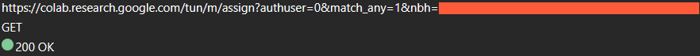

# Google Hash Crypto 

The hash function used to create a websocket session `nbh` token in [Google Colab](https://colab.research.google.com). You can find the original `JavaScript` version inside `original.js`, and the `C` code used to build the `libgoogcrypto.so` library inside the `googcrypto` folder. You can compile the project using the `Makefile` with the `make` command. It will output the `libgoogcrypto.so` file that you can then use with Python like so :

```python
import ctypes
import json


GOOGCRYPTO = ctypes.CDLL("./libgoogcrypto.so")


def get_assign_nbh_token(notebook_id: str) -> str:
    file = [["fileId"], [notebook_id]]
    json_data = json.dumps(file, separators=(",", " "))
    c_json_data = json_data.encode("utf-8")

    GOOGCRYPTO.hash_json_file_object.argtypes = [ctypes.c_char_p]
    GOOGCRYPTO.hash_json_file_object.restype = ctypes.POINTER(ctypes.c_ubyte)

    GOOGCRYPTO.free_hash.argtypes = [ctypes.POINTER(ctypes.c_ubyte)]

    result = GOOGCRYPTO.hash_json_file_object(c_json_data)
    result_string = ctypes.string_at(result).decode("utf-8")

    GOOGCRYPTO.free_hash(result)

    return result_string

if __name__ == "__main__":
    import sys

    if sys.argv.__len__() < 2:
        print("You must pass the notebook ID.", file=sys.stderr)
        exit(1)
    notebook_id = sys.argv[1]
    print(get_assign_nbh_token(notebook_id=notebook_id))
```

# What's `nbh` token ?



The `nbh` token is used in order to assign a web socket session to your google account which will allow you to execute your notebook cells.
